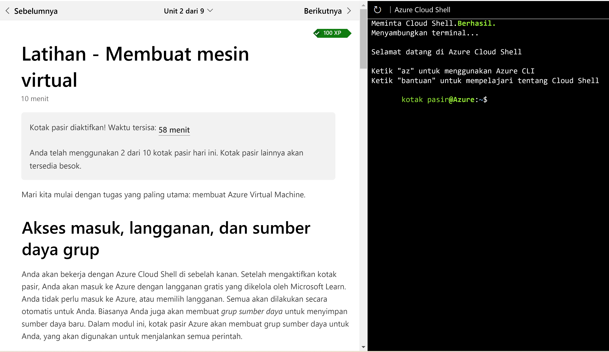
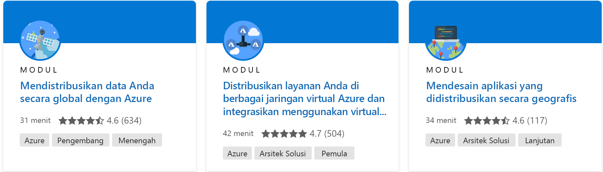

# <a name="microsoft-learn-catalog-api"></a>Microsoft Learn Catalog API

Microsoft Learn Catalog API memungkinkan Anda mengirim kueri berbasis web ke Microsoft Learn dan mendapatkan kembali detail tentang konten pelatihan yang tersedia dan ujian sertifikasi seperti judul, produk yang tercakup, durasi, URL, dan banyak lagi. Ini adalah API Web berbasis REST yang mengembalikan respons yang dikodekan JSON.

Ini mengembalikan informasi tentang semua yang tersedia untuk umum:

- Modul
- Unit-unit
- Jalur Pembelajaran
- Kursus yang Dipimpin Instruktur
- Ujian
- Sertifikasi

Microsoft Learn Catalog API ditawarkan berdasarkan [Ketentuan Penggunaan API Microsoft.](/legal/microsoft-apis/terms-of-use) 

Halaman ini menyediakan detail teknis terkait API dan cara menginterpretasikan informasi yang ditampilkan. Penggunaan umum untuk API ini adalah untuk mengkueri informasi dan mengeksposnya di dalam sistem lain. Untuk mengeksplorasi cara mengintegrasikan API ini dengan fitur lain dari Microsoft Learn, lihat artikel [Memanfaatkan Learn di organisasi Anda](integrations.md).

> [!NOTE]
> API ini baru-baru ini diperbarui untuk mencakup kursus yang dipimpin instruktur, ujian, sertifikasi, daftar unit untuk modul, dan citra PNG. Lihat detail di bawah ini.

## <a name="api-endpoint"></a>Titik akhir API

Microsoft Learn Catalog API adalah API Web berbasis REST yang memberikan respons dalam kode JSON. Untuk meminta katalog lengkap, kirim permintaan GET ke:

```html
https://docs.microsoft.com/api/learn/catalog/
```

> [!IMPORTANT]
> Permintaan harus menggunakan protokol HTTPS.

### <a name="query-parameters"></a>Parameter kueri

Berikut adalah parameter kueri yang dapat disertakan dalam permintaan. Kolom **Wajib diisi** menunjukkan bahwa Anda harus menentukan parameter. Anda harus mengodekan nilai parameter kueri ke dalam URL.

| Nama | Nilai | Jenis | Diperlukan |
|------|-------|------|----------|
| bahasa | Kode bahasa yang valid dari [daftar bahasa yang didukung](/locale), misalnya 'id-id'. Metadata yang diberikan akan disajikan dalam bahasa yang diminta jika tersedia. Jika parameter ini tidak ditentukan, default 'id-id' akan digunakan. | string | Tidak |

## <a name="api-response"></a>Respons API

Layanan dapat mengembalikan kode status HTTP berikut.

| Kode status | Deskripsi |
|-------------|-------------|
| 200 | Berhasil. Isi respons mencakup data dalam kode JSON. |
| 400 | Salah satu parameter kueri tidak valid atau tidak ditemukan. |
| 404 | URL tidak ditemukan di server. |
| 500 | Kesalahan server tidak terduga. |
| 503 | Layanan tidak tersedia untuk sementara. |

Respons yang berhasil akan mencakup detail tentang semua modul dan jalur pembelajaran, seperti yang ditunjukkan di bawah ini.

> [!TIP]
> Sebaiknya simpan respons dan refresh tampilan data secara berkala, tidak hanya ketika diperlukan.

### <a name="response-body"></a>Isi respons

Isi respons yang sukses akan dikodekan dalam JSON dan memiliki sembilan bagian:

```json
{
    "modules": [ ... ],
    "units": [...],
    "learningPaths": [ ... ],
    "certifications": [ ... ],
    "exams": [ ... ],
    "courses": [ ... ],
    "levels": [ ... ],
    "products": [ ... ],
    "roles": [ ... ]
}
```

Setiap larik memiliki satu atau beberapa objek dalam kode JSON yang berisi data khusus untuk bagian respons tersebut.

1. `modules`: adalah larik modul yang diterbitkan.
1. `units`: adalah larik unit yang diterbitkan.
1. `learningPaths`: adalah larik jalur pembelajaran yang diterbitkan.
1. `certifications`: adalah larik sertifikasi yang diterbitkan.
1. `exams`: adalah larik ujian yang diterbitkan.
1. `courses`: adalah larik kursus pelatihan yang dipimpin instruktur yang diterbitkan.
1. `levels`: adalah larik kemungkinan tingkat audiens.
1. `products`: adalah larik produk dan layanan yang mungkin tercakup dalam katalog.
1. `roles`: adalah larik kemungkinan jabatan.

### <a name="module-records"></a>Data modul

Setiap catatan modul akan memiliki bentuk berikut:

```json
{
    "summary": "Explore the core concepts of cloud computing and how it can help your business.",
    "levels": [
        "beginner"
    ],
    "roles": [
        "administrator",
        "business-analyst",
        "developer"
    ],
    "products": [
        "azure",
        "azure-portal",
        "azure-resource-manager"
    ],
    "uid": "learn.principles-cloud-computing",
    "type": "module",
    "title": "Cloud Concepts - Principles of cloud computing",
    "duration_in_minutes": 62,
    "rating": {
        count: 2014,
        average: 4.84
    },
    "popularity": 0.8839785477023878, 
    "icon_url": "https://docs.microsoft.com/learn/achievements/principles-cloud-computing.svg",
    "social_image_url": "https://docs.microsoft.com/learn/achievements/principles-cloud-computing-social.png",
    "locale": "en-us",
    "last_modified": "2018-09-24T00:00:00Z",
    "url": "https://docs.microsoft.com/en-us/learn/modules/principles-cloud-computing",
    "firstUnitUrl": "https://docs.microsoft.com/en-us/learn/modules/principles-cloud-computing/1-introduction",
    "units": [
        "learn.principles-cloud-computing.1-introduction",
        "learn.principles-cloud-computing.2-types-of-cloud-computing",
        "learn.principles-cloud-computing.3-benefits-of-cloud-computing",
        "learn.principles-cloud-computing.4-categories-of-cloud-services",
        "learn.principles-cloud-computing.5-knowledge-check",
        "learn.principles-cloud-computing.6-summary"
    ],
    "number_of_children": 6
}
```

#### <a name="field-details"></a>Detail bidang

| Bidang | Jenis | Deskripsi |
|-------|------|-------------|
| `summary` | string | String yang menyediakan deskripsi singkat tentang modul. Nilai disajikan sebagai tag paragraf HTML dengan ringkasan di teks bagian dalam. |
| `levels` | larik string | Daftar tingkat yang terkait dengan modul ini, yang menunjukkan berapa banyak pengalaman dalam peran yang diperlukan untuk memahami semua aspek modul ini. Detail tentang unit dapat dirujuk dalam catatan tingkat. |
| `roles` | larik string | Daftar jabatan yang relevan dengan modul ini. |
| `products` | larik string | Daftar produk relevan yang dicakup dalam modul ini. Detail tentang produk dapat dirujuk dalam catatan produk. |
| `uid` | string | Pengidentifikasi unik untuk modul ini - nilai ini bersifat unik di seluruh MS Learn. |
| `type` | string | Tipe data. Nilainya akan selalu 'module'. |
| `title` | string | Judul modul dalam bahasa yang diminta, atau bahasa Inggris AS sebagai alternatif. |
| `duration_in_minutes` | integer | Waktu rata-rata yang diperlukan untuk menyelesaikan modul ini dalam hitungan menit. |
| `rating` | objek | Berisi `count`, yaitu jumlah orang yang telah menilai modul, dan `average`, yang merupakan gabungan nilai, yaitu 1-5 |
| `popularity` | double | Nilai yang dinormalkan dari 0-1 menunjukkan popularitas modul | 
| `icon_url` | string | URL yang memenuhi syarat sepenuhnya ke gambar SVG berukuran 100x100 yang mewakili gambar pencapaian modul dengan latar belakang transparan. |
| `social_image_url` | string | URL yang berkualifikasi penuh ke gambar PNG yang mewakili gambar pencapaian modul dengan latar belakang buram persegi panjang, cocok untuk pengalaman media sosial atau ubin. Jika tidak tersedia untuk modul ini, properti ini tidak akan dikembalikan sebagai tanggapan. |
| `locale` | string | Bahasa yang digunakan dalam data JSON ini. Nilai ini akan menggunakan bahasa yang diminta jika tersedia, jika tidak 'en-us'. |
| `last_modified` | tanggal | Terakhir kali modul ini mendapat revisi besar. |
| `url` | string | URL yang sepenuhnya memenuhi syarat untuk modul di Microsoft Learn dalam bahasa yang diminta. |
| `firstUnitUrl` | string | URL yang sepenuhnya memenuhi syarat untuk unit pertama modul di Microsoft Learn dalam bahasa yang diminta. |
| `units` | larik string | Daftar UID unit terkait. Detail tentang unit dapat dirujuk dalam catatan tingkat. |
| `number_of_children` | integer | Jumlah halaman (unit) yang dimiliki modul ini. |

### <a name="unit-records"></a>Catatan unit

Setiap catatan unit akan memiliki bentuk berikut:

```json
{
    "uid": "learn.azure.fundamental-azure-concepts.types-of-cloud-computing",
    "type": "unit",
    "title": "Discuss different types of cloud models",
    "duration_in_minutes": 5,
    "locale": "en-us",
    "last_modified": "2021-12-09T02:45:00+00:00"
},
```

> [!NOTE]
> Catatan unit tidak memiliki URL terkait karena unit tidak ditulis sebagai konten yang berdiri sendiri. Mereka dimaksudkan untuk diambil dalam urutan tertentu untuk modul. Untuk alasan ini, kami menyertakan tautan ke halaman detail modul dan unit pertama dalam catatan modul sehingga pengguna dapat memulai di sana dan melanjutkan melalui konten. Namun, catatan unit dapat digunakan untuk mendapatkan detail tentang unit untuk ditampilkan di LMS atau pengalaman lainnya.

#### <a name="field-details"></a>Detail bidang

| Bidang | Jenis | Deskripsi |
|-------|------|-------------|
| `uid` | string | Pengidentifikasi unik untuk modul ini - nilai ini bersifat unik di seluruh MS Learn. |
| `type` | string | Tipe data. Nilainya akan selalu 'unit'. |
| `title` | string | Judul unit dalam bahasa yang diminta, atau bahasa Inggris AS sebagai alternatif. |
| `duration_in_minutes` | Durasi unit. Jika Anda menambahkan semua duration_in_minutes unit yang terkait dengan setiap modul, Anda akan mendapatkan total waktu modul. |
| `locale` | string | Bahasa yang digunakan dalam data JSON ini. Nilai ini akan menggunakan bahasa yang diminta jika tersedia, jika tidak 'en-us'. |
| `last_modified` | tanggal | Terakhir kali modul ini mendapat revisi besar. |

### <a name="learning-path-records"></a>Data jalur pembelajaran

Setiap catatan jalur pembelajaran akan memiliki bentuk berikut:

```json
{
    "summary": "Azure Functions enable the creation of event driven, compute-on-demand systems that can be triggered by various external events. Learn how to leverage functions to execute server-side logic and build serverless architectures.",
    "levels": [
        "beginner",
        "intermediate"
    ],
    "roles": [
        "developer",
        "solution-architect"
    ],
    "products": [
        "azure",
        "azure-portal",
        "azure-functions",
        "azure-cosmos-db",
        "azure-cloud-shell"
    ],
    "uid": "learn.create-serverless-applications",
    "type": "learningPath",
    "title": "Create serverless applications",
    "duration_in_minutes": 450,
    "rating": {
        count: 2014,
        average: 4.84
    },
    "popularity": 0.8839785477023878, 
    "icon_url": "https://docs.microsoft.com/learn/achievements/create-serverless-applications.svg",
    "social_image_url": "https://docs.microsoft.com/learn/achievements/create-serverless-applications-social.png",
    "locale": "en-us",
    "last_modified": "2018-12-27T00:00:00Z",
    "url": "https://docs.microsoft.com/en-us/learn/paths/create-serverless-applications",
    "firstModuleUrl": "https://docs.microsoft.com/en-us/learn/modules/choose-azure-service-to-integrate-and-automate-business-processes/",
    "modules": [
        "learn.choose-azure-service-to-integrate-and-automate-business-processes",
        "learn.create-serverless-logic-with-functions",
        "learn.execute-azure-function-with-triggers",
        "learn.chain-azure-functions-data-using-input-output-bindings",
        "learn.azure-create-long-running-serverless-workflow-with-durable-functions",
        "learn-pr.develop-test-deploy-azure-functions-core-tools",
        "learn.develop-test-deploy-azure-functions-with-visual-studio",
        "learn.azure.monitor-github-events-with-a-function-triggered-by-a-webhook",
        "learn.advocates.azure-functions-and-signalr"
    ],
    "number_of_children": 9
}
```

#### <a name="field-details"></a>Detail bidang

| Bidang | Jenis | Deskripsi |
|-------|------|-------------|
| `summary` | string | String yang menyediakan deskripsi singkat tentang jalur pembelajaran. Nilai disajikan sebagai tag paragraf HTML dengan ringkasan di teks bagian dalam. |
| `levels` | larik string | Daftar tingkat yang terkait dengan jalur pembelajaran ini, yang menunjukkan berapa banyak pengalaman dalam peran yang diperlukan untuk memahami semua aspek jalur pembelajaran ini. Detail tentang unit dapat dirujuk dalam catatan tingkat. |
| `roles` | larik string | Daftar jabatan yang relevan untuk jalur pembelajaran ini. |
| `products` | larik string | Daftar produk relevan yang dicakup dalam produk ini. Detail tentang produk dapat dirujuk dalam catatan produk. |
| `uid` | string | Pengidentifikasi unik untuk jalur pembelajaran ini - nilai ini bersifat unik di seluruh MS Learn. |
| `type` | string | Tipe data. Nilainya selalu 'learningPath'. |
| `title` | string | Judul jalur pembelajaran dalam bahasa yang diminta, atau bahasa Inggris AS sebagai alternatif. |
| `duration_in_minutes` | integer | Waktu rata-rata yang diperlukan untuk menyelesaikan jalur pembelajaran ini dalam hitungan menit. Nilai ini merupakan jumlah data dari semua modul yang disertakan. |
| `rating` | objek | Berisi `count`, yaitu jumlah orang yang telah menilai jalur pembelajaran, dan `average`, yang merupakan gabungan nilai, yaitu 1-5 |
| `popularity` | double | Nilai yang dinormalkan dari 0-1 menunjukkan popularitas jalur pembelajaran | 
| `icon_url` | string | URL yang sepenuhnya memenuhi syarat untuk gambar SVG berukuran 100x100 yang mewakili jalur pembelajaran. |
| `social_image_url` | string | URL yang berkualifikasi penuh ke gambar PNG yang mewakili gambar pencapaian jalur pembelajaran dengan latar belakang buram persegi panjang, cocok untuk pengalaman media sosial atau ubin. Jika tidak tersedia untuk modul ini, properti ini tidak akan dikembalikan sebagai tanggapan. |
| `locale` | string | Bahasa yang digunakan dalam data JSON ini. Nilai ini akan menggunakan bahasa yang diminta jika tersedia, jika tidak 'en-us'. |
| `last_modified` | tanggal | Terakhir kali jalur pembelajaran ini diubah. |
| `url` | string | URL yang sepenuhnya memenuhi syarat untuk jalur pembelajaran di Microsoft Learn dalam bahasa yang diminta. |
| `firstModuleUrl` | string | URL yang sepenuhnya memenuhi syarat untuk modul pertama jalur pembelajaran di Microsoft Learn dalam bahasa yang diminta. |
| `modules` | larik string | Daftar UID modul terkait. Detail tentang modul dapat dirujuk dalam catatan modul. |
| `number_of_children` | integer | Jumlah modul yang dimiliki jalur pembelajaran ini. |

### <a name="certification-records"></a>Catatan sertifikasi

Setiap catatan sertifikasi akan memiliki bentuk berikut:

```json
{
    "uid": "certification.d365-functional-consultant-customer-service",
    "title": "Microsoft Certified: Dynamics 365 Customer Service Functional Consultant Associate",
    "subtitle": "Microsoft Dynamics 365 Customer Service functional consultants are responsible for implementing omnichannel solutions that focus on service, quality, reliability, efficiency, and customer satisfaction.",
    "url": "https://docs.microsoft.com/en-us/cert-exam-sandbox/cert/?WT.mc_id=api_CatalogApi",
    "icon_url": "https://docs.microsoft.com/en-us/media/learn/certification/badges/microsoft-certified-associate-badge.svg",
    "type": "cert",
    "certification_type": "role-based",
    "exams": [
        "exam.77-881"
    ],
    "levels": [
        "intermediate"
    ],
    "roles": [
        "functional-consultant"
    ],
    "study_guide": [
        {
            "uid": "learn.get-started-with-d365",
            "type": "module"
        },
        {
            "uid": "learn.d365-notebook",
            "type": "module"
        },
        {
            "uid": "learn.d365-fundamentals",
            "type": "learningPath"
        }
    ]
}
```

#### <a name="field-details"></a>Detail bidang

| Bidang | Jenis | Deskripsi |
|-------|------|-------------|
| `uid` | string | Pengidentifikasi unik untuk sertifikasi ini - nilai ini bersifat unik di seluruh MS Learn. |
| `title` | string | Judul sertifikasi dalam bahasa yang diminta, atau bahasa Inggris AS sebagai alternatif. |
| `subtitle` | string | Subtitel sertifikasi dalam bahasa yang diminta, atau bahasa Inggris AS sebagai alternatif. |
| `url` | string | URL yang sepenuhnya memenuhi syarat untuk sertifikasi di Microsoft Learn dalam bahasa yang diminta. |
| `icon_url` | string | URL yang sepenuhnya memenuhi syarat untuk gambar SVG berukuran 100x100 yang mewakili sertifikasi. |
| `type` | string | Tipe data. Nilainya akan selalu 'cert'. |
| `certification_type` | string | Jenis sertifikasi. Nilai-nilai yang mungkin adalah 'fundamental', 'mce', 'mcsa', 'mcsd', 'mcse', 'mos', 'mta', 'role-based', 'specialty'. |
| `exams` | larik string | Daftar ujian terkait yang diperlukan untuk sertifikasi ini. Detail tentang unit dapat dirujuk dalam catatan sertifikasi. |
| `levels` | larik string | Daftar tingkat yang terkait dengan sertifikasi ini, yang menunjukkan berapa banyak pengalaman dalam peran yang diperlukan untuk memahami semua aspek ujian sertifikasi ini. Detail tentang unit dapat dirujuk dalam catatan tingkat. |
| `roles` | larik string | Daftar jabatan yang relevan untuk sertifikasi ini. Detail tentang peran dapat dirujuk dalam catatan peran. |
| `study_guide` | array objek | Daftar konten terkait untuk dipelajari untuk sertifikasi ini. Detail tentang objek dapat dirujuk dalam catatan terkait. |

### <a name="exam-records"></a>Catatan ujian

Setiap catatan ujian akan memiliki bentuk berikut:

```json
{
    "uid": "exam.77-881",
    "title": "Word 2010",
    "subtitle": "The core-level Microsoft Office Word 2010 user should be able to navigate Microsoft Office Word 2010 software at the feature and functional level. They should be familiar with and know how to use at least 80 percent of the features and capabilities of Microsoft Office Word 2010. The core-level user should be able to use Microsoft Office Word 2010 to create and edit professional-looking documents for a variety of purposes and situations. Users would include people from a wide variety of job roles from almost all areas of professional, student, and personal life.",
    "display_name": "77-881",
    "url": "https://docs.microsoft.com/en-us/cert-exam-sandbox/exam/77-881/?WT.mc_id=api_CatalogApi",
    "icon_url": "https://docs.microsoft.com/en-us/media/learn/certification/badges/certification-exam.svg",
    "pdf_download_url": "https://query.prod.cms.rt.microsoft.com/cms/api/am/binary/RE4trjX",
    "practice_test_url": "https://www.mindhub.com/70-413-Designing-and-Implementing-a-Server-Infrast-p/mu-70-413_p.htm?utm_source=microsoft&amp;utm_medium=certpage&amp;utm_campaign=msofficialpractice",
    "locales": [],
    "type": "exam",
    "courses": [
        "course.pl-200t00",
        "course.mb-230t01"
    ],
    "levels": [
        "beginner"
    ],
    "roles": [
        "business-user"
    ],
    "products": [
        "office-word"
    ],
    "providers": [],
    "study_guide": [
        {
            "uid": "learn.get-started-with-word-2010",
            "type": "module"
        },
        {
            "uid": "learn.office2010-notebook",
            "type": "module"
        },
        {
            "uid": "learn.office2010-fundamentals",
            "type": "learningPath"
        }
    ]
}
```

#### <a name="field-details"></a>Detail bidang

| Bidang | Jenis | Deskripsi |
|-------|------|-------------|
| `uid` | string | Pengidentifikasi unik untuk ujian ini - nilai ini bersifat unik di seluruh MS Learn. |
| `title` | string | Judul ujian dalam bahasa yang diminta, atau bahasa Inggris AS sebagai alternatif. |
| `subtitle` | string | Subtitel ujian dalam bahasa yang diminta, atau bahasa Inggris AS sebagai alternatif. |
| `display_name` | string | Nama tampilan dalam bahasa yang diminta, atau bahasa Inggris AS sebagai alternatif. |
| `url` | string | URL yang sepenuhnya memenuhi syarat untuk ujian di Microsoft Learn dalam bahasa yang diminta. |
| `icon_url` | string | URL yang sepenuhnya memenuhi syarat untuk gambar SVG berukuran 100x100 yang mewakili ujian. |
| `pdf_download_url` | string | URL yang berkualifikasi penuh ke PDF menguraikan keterampilan yang diukur dengan ujian ini. |
| `practice_test_url` | string | URL yang berkualifikasi penuh untuk tes praktik yang terkait dengan ujian. |
| `locales` | larik string | Daftar bahasa ujian ini ditawarkan. |
| `type` | string | Tipe data. Nilainya akan selalu 'ujian'. |
| `courses` | larik string | Daftar UID kursus terkait. Detail tentang kursus dapat dirujuk dalam catatan kursus. |
| `levels` | larik string | Daftar tingkat yang terkait dengan ujian ini, yang menunjukkan berapa banyak pengalaman dalam peran yang diperlukan untuk memahami semua aspek ujian ini. Detail tentang unit dapat dirujuk dalam catatan tingkat. |
| `roles` | larik string | Daftar jabatan yang relevan untuk ujian ini. Detail tentang peran dapat dirujuk dalam catatan peran. |
| `products` | larik string | Daftar produk relevan yang dicakup dalam ujian ini. Detail tentang produk dapat dirujuk dalam catatan produk. |
| `providers` | array objek | Daftar penyedia untuk ujian ini. Jenis ini menjelaskan penyedia mana dan URL yang berkualifikasi penuh dengan tautan untuk menjadwalkan ujian dengan penyedia. |
| `study_guide` | array objek | Daftar konten terkait untuk dipelajari untuk ujian ini. Detail tentang objek dapat dirujuk dalam catatan terkait. |

### <a name="instructor-led-course-records"></a>Catatan kursus yang dipimpin instruktur

Setiap catatan kursus akan memiliki bentuk berikut:

```json
{
    "uid": "course.mb-230t01",
    "course_number": "MB-230T01",
    "title": "Microsoft Dynamics 365 Customer Service - added non-exist studyguide",
    "summary": "Microsoft Dynamics 365 Customer Service offers any organization an opportunity for customer success. Using tools such as automatic case creation and queue management frees up your time to dedicate it where you can have a greater impact, directly with your customers.Join our team of globally recognized experts as they take you step by step from creating cases to interacting with customers to resolving those cases. Once you’ve resolved those cases you can learn from data analysis the key details to help you resolve similar cases faster or avoid new issues altogether. A Dynamics 365 Customer Engagement Functional Consultant is responsible for performing discovery, capturing requirements, engaging subject matter experts and stakeholders, translating requirements, and configuring the solution and applications. The Functional Consultant implements a solution using out of the box capabilities, codeless extensibility, application and service integrations.",
    "duration_in_hours": 72,
    "url": "https://docs.microsoft.com/en-us/cert-exam-sandbox/course/mb-230t01/?WT.mc_id=api_CatalogApi",
    "icon_url": "https://docs.microsoft.com/en-us/media/learn/certification/course.svg",
    "locales": [
        "en"
    ],
    "type": "course",
    "certification": "certification.d365-functional-consultant-customer-service",
    "exam": "exam.77-881",
    "levels": [
        "intermediate"
    ],
    "roles": [
        "functional-consultant"
    ],
    "products": [
        "dynamics-365"
    ],
    "study_guide": [
        {
            "uid": "learn.align-requirements-in-azure",
            "type": "module"
        },
        {
            "uid": "learn.manage-resources-in-azure",
            "type": "learningPath"
        }
    ]
},
```

#### <a name="field-details"></a>Detail bidang

| Bidang | Jenis | Deskripsi |
|-------|------|-------------|
| `uid` | string | Pengidentifikasi unik untuk kursus yang dipimpin instruktur ini - nilai ini bersifat unik di seluruh MS Learn. |
| `course_number` | string | Pengenal nomor kursus yang dipimpin instruktur. |
| `title` | string | Judul kursus yang dipimpin instruktur dalam bahasa yang diminta, atau bahasa Inggris AS sebagai alternatif. |
| `summary` | string | String yang menyediakan deskripsi singkat tentang yang dipimpin instruktur. Nilai disajikan sebagai tag paragraf HTML dengan ringkasan di teks bagian dalam. |
| `duration_in_hours` | bilangan bulat | Waktu rata-rata kursus yang dipimpin instruktur ini harus diselesaikan dalam hitungan jam. |
| `url` | string | URL yang berkualifikasi penuh ke halaman detail kursus yang dipimpin instruktur di Microsoft Learn dalam bahasa yang diminta. |
| `icon_url` | string | URL yang memenuhi syarat untuk gambar SVG berukuran 100x100 yang mewakili pencapaian kursus yang dipimpin instruktur. |
| `locales` | larik string | Daftar bahasa kursus yang dipimpin instruktur ini secara resmi ditawarkan. Bahasa lain dapat didukung oleh mitra belajar. |
| `type` | string | Tipe data. Nilainya akan selalu menjadi 'kursus' untuk kursus yang dipimpin instruktur. |
| `certification` | string | Sertifikasi yang terkait dengan kursus yang dipimpin instruktur. |
| `exam` | string | Sertifikasi yang terkait dengan kursus yang dipimpin instruktur. |
| `levels` | larik string | Daftar tingkat yang terkait dengan kursus yang dipimpin instruktur ini, yang menunjukkan berapa banyak pengalaman dalam peran yang diperlukan untuk memahami semua aspek kursus ini. Detail tentang unit dapat dirujuk dalam catatan tingkat. |
| `study_guide` | array objek | URL yang berkualifikasi penuh ke PDF menguraikan keterampilan yang diukur dengan sertifikasi ini. |

### <a name="product-role-and-level-records"></a>Data produk, peran, dan tingkat

Kumpulan `levels`, `roles`, dan `products` menyediakan nama yang umum untuk nilai yang digunakan dalam data modul dan jalur pembelajaran. Ketiga kumpulan tersebut memiliki bentuk yang sama:

```json
{
    "id": "unique-id",
    "name": "name-of-item",
    "children": [
        { "id": "unique-id", "name": "name-of-item" },
        { "id": "unique-id", "name": "name-of-item" },
           ...
    ]
}
```

`id` akan menyesuaikan nilai untuk tingkat, peran, dan produk yang termasuk dalam entri katalog lainnya. `name` yang terkait menyediakan nama yang tepat dalam bahasa Inggris untuk entri tersebut. Larik `children` bersifat opsional dan memungkinkan hierarkis untuk nilai yang memiliki hubungan turunan seperti produk.

Misalnya, berikut adalah sekumpulan peran yang mungkin digunakan:

```json
{
    ...
    "roles": [
        {
            "id": "administrator",
            "name": "Administrator"
        },
        {
            "id": "ai-engineer",
            "name": "AI Engineer"
        },
        {
            "id": "business-analyst",
            "name": "Business Analyst"
        },
        {
            "id": "developer",
            "name": "Developer"
        },
        ...
    ]
}
```

Berikut adalah contoh kumpulan produk, dengan turunan yang disertakan untuk memberikan kategori produk yang lebih spesifik.

```json
{
    ...
    "products": [
        {
            "id": "dotnet",
            "name": ".NET",
            "children": [
                { "id": "dotnet-core", "name": ".NET Core" },
                { "id": "dotnet-standard", "name": ".NET Standard" },
                { "id": "aspnet-core", "name": "ASP.NET Core" },
                { "id": "ef-core", "name": "Entity Framework Core" }
            ]
        },
        {
            "id": "ms-graph",
            "name": "Microsoft Graph"
        },
        {
            "id": "office",
            "name": "Office",
            "children": [
                { "id": "office-365", "name": "Office 365" },
                { "id": "office-add-ins", "name": "Office Add-ins" },
                { "id": "office-teams", "name": "Teams" }
            ]
        },
        {
            "id": "sql-server",
            "name": "SQL Server"
        },
        ...
    ]
}

```


## <a name="code-samples"></a>Sampel kode

Ada banyak cara untuk memanggil Learn Catalog API, tetapi ini adalah berbagai macam sampel kode yang dapat digunakan.

### <a name="jquery"></a>jQuery

```jquery
$(function() {
    var params = {
        locale:'en-us'
    };
    $.ajax({
        url: "https://docs.microsoft.com/api/learn/catalog?" + $.param(params),
            type: "GET"
    }).done(function(data) {
        alert("success");
    }).fail(function(error) {
        alert("error");
    });
})
```

### <a name="net-c"></a>.NET C#

```csharp
public string GetCatalogData()
{
var client = new WebClient();
client.Headers.Add(HttpRequestHeader.UserAgent, "Mozilla/5.0 (Windows NT 10.0; WOW64; Trident/7.0; rv:11.0) like Gecko");
var response = client.DownloadString("https://docs.microsoft.com/api/learn/catalog?locale=en-us");
dynamic parsedJson = JsonConvert.DeserializeObject(response);
JsonConvert.SerializeObject(response, Formatting.Indented);
return Convert.ToString(response);
}
```

### <a name="php-using-curl-extension"></a>PHP menggunakan ekstensi cURL

```php
<?php 

// From URL to get webpage contents. 
$url = "https://docs.microsoft.com/api/learn/catalog"; 

// Initialize a CURL session. 
$ch = curl_init(); 

// Return Page contents. 
curl_setopt($ch, CURLOPT_RETURNTRANSFER, 1);
 
//grab URL and pass it to the variable. 
curl_setopt($ch, CURLOPT_URL, $url); 

$result = curl_exec($ch); 

echo $result;

?>
```

### <a name="python-3-using-requests-library"></a>PYTHON 3 menggunakan pustaka 'permintaan'

```python

#!/usr/bin/env python3
#Using Python 3.8.2 install 5/6/2020

import requests
import json

#if given error 'response / requests not defined', install requests via 'pip install requests' in the command line

parameters= {"locale": "en-us"}

response = requests.get("https://docs.microsoft.com/api/learn/catalog/", parameters)

#print(response.status_code)

rawJson = response._content

#Create python objects based on the data using json.loads

data = json.loads(rawJson)

print(data)
```

## <a name="catalog-type-descriptions"></a>Deskripsi tipe katalog

### <a name="web-based-asynchronous-training"></a>Pelatihan berbasis web (asinkron)

Konten pelatihan berbasis web (asinkron) di Microsoft Learn disusun secara hierarkis. Modul adalah jenis konten yang paling terkenal karena secara efektif merupakan kursus yang berdiri sendiri. Detail lebih lanjut tentang setiap jenis konten berbasis web di Learn dan strukturnya ada di bawah ini.


#### <a name="units"></a>Unit-unit

Sebuah _unit_ berisi konten pelatihan yang sebenarnya, disajikan sebagai halaman web individu dengan berbagai pengalaman pada mereka (teks saja, teks dan video, pemeriksaan pengetahuan, pengalaman interaktif, dan banyak lagi). Meskipun pengguna mendapatkan kredit untuk penyelesaian unit individu, mereka bukan pelatihan yang berdiri sendiri. Setiap unit adalah subset dari modul (dan hanya terkait dengan modul tunggal).

Di bawah ini adalah cuplikan layar dari unit yang memiliki kotak pasir Azure Cloud Shell diaktifkan.



Untuk melihat contoh langsung dari sebuah unit, kunjungi [Menulis ke beberapa wilayah](/learn/modules/distribute-data-globally-with-cosmos-db/3-multi-region-write), yang merupakan unit dalam [Mendistribusikan data Anda secara global dengan modul Azure Cosmos DB](/learn/modules/distribute-data-globally-with-cosmos-db/).

Untuk meninjau detail tentang respons unit di API, kunjungi [Catatan unit](/learn/support/catalog-api#unit-records) di bagian respons API di bawah ini.

#### <a name="modules"></a>Modul

_Modul_ adalah kursus pelatihan berbasis web yang berdiri sendiri dan asinkron di Microsoft Learn. Mereka biasanya kecil (kurang dari satu jam) dan mengeksplorasi layanan atau teknologi, sementara sering memberikan beberapa bentuk interaktivitas untuk mencoba teknologi. Modul dapat diambil sendiri, atau dalam konteks satu atau beberapa jalur pembelajaran.

Setiap modul terdiri dari beberapa halaman web, yang disebut _unit_, dan metadata terkait untuk dengan cepat mengidentifikasi untuk siapa, apa yang tercakup, dan berapa lama biasanya diperlukan untuk menyelesaikannya. Detail ini dapat ditemukan di ubin grafis pada halaman penelusuran Microsoft Learn, seperti yang diperlihatkan dalam cuplikan layar berikut ini.



Untuk melihat contoh langsung dari modul, kunjungi [Mendistribusikan data Anda secara global dengan Azure Cosmos DB](/learn/modules/distribute-data-globally-with-cosmos-db/).

Untuk meninjau detail tentang respons modul di API, kunjungi [Catatan modul](/learn/support/catalog-api#module-records) di bagian respons API di bawah ini.

#### <a name="learning-paths"></a>Jalur Pembelajaran

_Jalur pembelajaran_ adalah kumpulan modul terkait yang disajikan dalam urutan tertentu sehingga modul tersebut saling melengkapi untuk mengajarkan keterampilan yang lebih luas. Jalur pembelajaran juga menyertakan metadata deskriptif yang mirip dengan modul, seperti yang ditunjukkan pada cuplikan layar dari halaman penelusuran di bawah ini.


Untuk melihat contoh langsung dari jalur pembelajaran, kunjungi [Bekerja dengan data NoSQL di Azure Cosmos DB](/learn/paths/work-with-nosql-data-in-azure-cosmos-db/).

Untuk meninjau detail tentang respons jalur pembelajaran di API, kunjungi [Catatan jalur pembelajaran](/learn/support/catalog-api#learning-path-records) di bagian respons API di bawah ini.

### <a name="instructor-led-training"></a>Pelatihan yang dipimpin instruktur

Pelatihan yang dipimpin instruktur yang ditawarkan oleh Microsoft dan mitra pengirimannya dapat ditemukan dan didaftarkan melalui Microsoft Learn. Kursus yang dipimpin instruktur ini tersedia melalui Learn Catalog API.
#### <a name="course"></a>Kursus

_Kursus_ yang dipimpin instruktur adalah pelatihan sinkron yang disajikan oleh instruktur.


Untuk melihat contoh langsung dari kursus yang dipimpin instruktur, kunjungi [Course MB-220T00: Microsoft Dynamics 365 Marketing](/learn/certifications/courses/mb-220t00).

Untuk meninjau detail tentang respons kursus di API, kunjungi [Catatan kursus](/learn/support/catalog-api#course-records) di bagian respons API di bawah ini.

### <a name="exams-and-certifications"></a>Ujian dan Sertifikasi

Kredensial profesional adalah tujuan penting bagi beberapa peserta didik. Microsoft menawarkan beberapa sertifikasi industri yang dapat dicapai melalui penyelesaian ujian, dan dibagikan dengan pengusaha. Sertifikasi dan ujian terkait tersedia untuk didaftarkan melalui situs Microsoft Learn dan detail yang diakses di Learn Catalog API.


#### <a name="exam"></a>Ujian

_Ujian_ adalah ujian yang diawasi oleh pengguna sebagai bagian dari perolehan _sertifikasi_.


Untuk melihat contoh langsung dari halaman detail ujian, kunjungi [Ujian AZ-104: Microsoft Azure Administrator](/learn/certifications/exams/az-104). Untuk melihat detail respons API untuk ujian, lihat bagian Ujian di bawah ini.

Untuk meninjau detail tentang respons ujian di API, kunjungi [Catatan ujian](/learn/support/catalog-api#exam-records) di bagian respons API di bawah ini.

#### <a name="certification"></a>Sertifikasi

_Sertifikasi_ adalah kredensial profesional yang diperoleh melalui penyelesaian satu atau beberapa _ujian_ yang berhasil.


Untuk melihat contoh langsung dari halaman detail sertifikasi, kunjungi [Microsoft Certified: Azure Administrator Associate](/learn/certifications/azure-administrator/).

Untuk meninjau detail tentang respons sertifikasi di API, kunjungi [Catatan sertifikasi](/learn/support/catalog-api#certification-records) di bagian respons API di bawah ini.

## <a name="frequently-asked-questions"></a>Tanya jawab umum

**T: Apakah pelatihan tersedia dalam bahasa lain?**

Tergantung. Sebagian besar konten tersedia dalam bahasa yang tersedia untuk produk yang diajarkannya.

**T: Apakah data yang dikembalikan dari Catalog API tetap statis atau berubah?**

Data berubah setiap kali konten baru ditambahkan, yang biasanya setidaknya sekali seminggu.

**T: Mengapa ada tag HTML dalam ringkasan modul?**

Kami biasanya mencoba untuk menjaga format ringkasan sementah mungkin, tetapi kadang-kadang kita perlu menekankan atau menghubungkan teks tertentu.

**T: Apakah UID bersifat unik untuk konten?**

Ya.

**T: Mengapa tidak ada tautan untuk masing-masing unit?**

Unit tidak ditulis sebagai konten yang berdiri sendiri. Mereka dimaksudkan untuk diambil dalam urutan tertentu untuk modul. Untuk alasan ini, kami menyertakan tautan ke halaman detail modul dan unit pertama dalam catatan modul sehingga pengguna dapat memulai di sana dan melanjutkan melalui konten.

**T: Bagaimana cara mengetahui konten apa yang baru?**

Nilai `last_modified` akan memberi tahu Anda kapan rekaman terakhir dimodifikasi.

**T: Apakah semua modul adalah bagian dari jalur pembelajaran?**

Nomor. Modul berdiri sendiri dalam arti bahwa mereka mengajarkan skenario atau konsep end-to-end di dalamnya. Bagi sebagian orang, ini dia yang dimaksud dan mereka bukan bagian dari jalur pembelajaran. Bagi yang lain, mereka dibundel bersama dalam satu atau beberapa jalur pembelajaran yang membawa pengguna melalui membangun konsep yang lebih maju. Modul tidak harus menjadi bagian dari jalur pembelajaran, atau dapat menjadi bagian dari satu atau beberapa.

**T: Apakah API ini akan memungkinkan pengguna kami menggunakan konten Learn di dalam platform kami?**

Nomor. Catalog API menyediakan metadata, termasuk tautan langsung ke konten. Mitra dapat mengintegrasikan ini ke dalam LMS atau pengalaman web apa pun.

**T: Apakah ada API pelaporan untuk mendapatkan data seperti tampilan, klik, penyelesaian?**

Nomor. Kami memiliki [fungsi pelaporan organisasi](org-reporting.md) yang memungkinkan organisasi untuk melaporkan penyelesaian pengguna mereka. Selain itu, untuk mengeksplorasi cara mengintegrasikan API ini dengan fitur lain dari Microsoft Learn, lihat artikel [Memanfaatkan Learn di organisasi Anda](integrations.md).

**T: Apakah SSO diaktifkan untuk tautan ini?**

Lain kali. Kami memiliki ini di peta jalan kami untuk iterasi di masa depan.

## <a name="catalog-api-program"></a>Program Catalog API

Apakah Anda mengintegrasikan konten Microsoft Learn ke dalam platform pembelajaran Anda? Daftar [Program Catalog API (CAP)](https://forms.office.com/Pages/ResponsePage.aspx?id=v4j5cvGGr0GRqy180BHbR-4aRF51x15HqVFOq2xnAkBUMUJJWFVZWDdUNFQ0TTRaTlA2VVowRDVFSS4u) agar tim kami dapat membantu memastikan pengalaman integrasi yang terbaik dan mendapatkan masukan Anda terkait versi Catalog API mendatang.

## <a name="feedback-and-support"></a>Umpan balik dan dukungan

Catalog API saat ini tersedia tanpa perjanjian tingkat layanan. Jika memiliki saran atau mengalami masalah saat menggunakan API, Anda dapat [memberikan umpan balik kepada tim kami.](https://forms.office.com/Pages/ResponsePage.aspx?id=v4j5cvGGr0GRqy180BHbR_cebFBRf_dAnuWExXCcHVJUQU1PSDBONVc4WDZIN1RDTE1ISk41NlRJNi4u)
