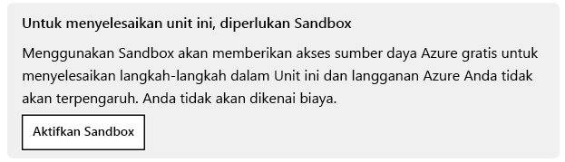
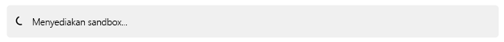
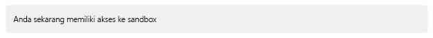
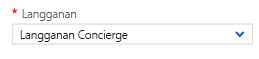
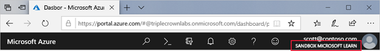
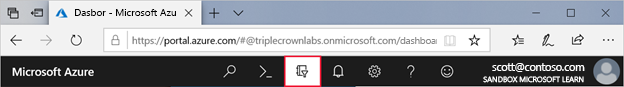
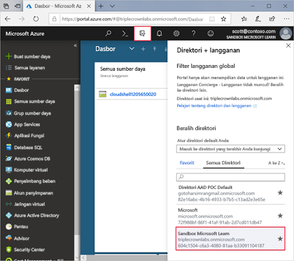
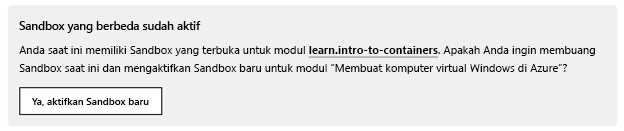

# Tanya jawab umum

::: zone pivot="general"

## Apa itu Microsoft Learn?

Microsoft Learn adalah platform pelatihan online gratis yang menyediakan pembelajaran interaktif untuk produk Microsoft dan banyak lagi. Tujuan kami adalah agar Anda mahir menggunakan teknologi kami dan mempelajari lebih banyak keterampilan menggunakan konten interaktif langsung yang menarik dan dipandu sesuai peran dan tujuan Anda. Pelajari selengkapnya dalam [video](https://channel9.msdn.com/Blogs/One-Dev-Minute/What-is-Microsoft-Learn) ini.

## Berapa harganya?

Microsoft Learn adalah platform pelatihan terbuka yang tersedia gratis bagi setiap orang yang tertarik untuk mempelajari tentang produk Microsoft.

## Konten apa yang tersedia di Microsoft Learn?

Kami menyediakan jalur pembelajaran dan pelatihan berbasis peran untuk pengembang Azure, arsitek solusi, dan administrator. Kami juga menyediakan jalur pelatihan dan pembelajaran berbasis peran untuk Microsoft Power BI, PowerApps, Dynamics365, Microsoft365, Office, dan Visual Studio.

Kami berupaya memperluas platform ke berbagai produk dan layanan Microsoft lainnya.

## Apakah saya perlu membuat profil untuk menggunakan Microsoft Learn?

Tidak, Anda tidak perlu membuat profil. Tanpa profil, Anda tetap dapat mengakses dan menggunakan semua konten pembelajaran.

## Fitur apa saja yang tersedia saat saya masuk?

- Melacak kemajuan aktivitas pembelajaran
- Membuat dan berbagi koleksi modul
- Menyimpan bookmark
- Mendapatkan poin dan prestasi
- Menggunakan sumber daya Azure gratis
- Melihat rekomendasi yang dipersonalisasi

## Apa itu jalur pembelajaran?

Jalur pembelajaran adalah kumpulan modul yang diatur berdasarkan peran tertentu (seperti pengembang, arsitek, atau admin sistem) atau teknologi (seperti Azure Web Apps, Power BI, atau Xamarin.Forms).

Ketika menyelesaikan jalur pembelajaran, Anda akan mendapatkan pemahaman baru tentang berbagai aspek teknologi atau peran yang dipelajari. Anda juga akan mendapatkan piala!

## Apa itu modul?

Modul adalah bagian penting dari pengalaman Microsoft Learn. Anggap modul sebagai kursus yang berisi kumpulan unit yang terkait, seperti video, lab, dan artikel.

Ketika menyelesaikan modul, Anda akan mendapatkan keterampilan baru yang sesuai dengan peran dan teknologi target Anda. Anda juga mendapatkan lencana!

## Apa itu unit?

Unit adalah sebagian kecil informasi yang disertakan dalam modul. Unit dapat berupa konten pembelajaran, aktivitas interaktif, kuis, atau lainnya.

Meskipun hanya memiliki waktu selama beberapa menit, Anda dapat mempelajari hal baru dan mendapatkan XP dengan menyelesaikan unit.

## Apa itu koleksi?

Koleksi memungkinkan Anda dengan mudah memilih dan mengelola kumpulan konten serta membagikannya dengan siapa saja.

Meskipun koleksi tidak muncul di hasil pencarian atau profil publik Anda, setiap orang yang memiliki URL koleksi dapat mengaksesnya.

## Bahasa apa yang didukung Microsoft Learn?

Jalur pembelajaran produk kami mendukung bahasa berikut:

* **Azure** (17 bahasa): Jepang, Korea, Tionghoa (Tradisional), Tionghoa (Sederhana), Rusia, Jerman, Spanyol, Prancis, Italia, Portugis Brasil, Hungaria, Swedia, Cheska, Belanda, Portugis Iberia, Polski, Turki

* **Dynamics** (4 bahasa): Jepang, Jerman, Spanyol, Prancis

* **PowerBI** (23 bahasa): Jepang, Korea, Tionghoa (Tradisional), Tionghoa (Sederhana), Rusia, Jerman, Spanyol, Prancis, Italia, Portugis Brasil, Hungaria, Swedia, Cheska, Belanda, Portugis Iberia, Polski, Turki, Dansk, Yunani, Slovak, Suomi, Thai, Norwegia

* **PowerApps, PowerAutomate** (4 bahasa): Jepang, Jerman, Spanyol, Prancis 

* **SQL Server** (10 bahasa): Jepang, Korea, Tionghoa (Tradisional), Tionghoa (Sederhana), Rusia, Jerman, Spanyol, Prancis, Italia, Portugis Brasil

* **Windows Developer** (10 bahasa) Jepang, Korea, Tionghoa (Tradisional), Tionghoa (Sederhana), Rusia, Jerman, Spanyol, Prancis, Italia, Portugis Brasil

* **.Net** (13 bahasa): Jepang, Korea, Tionghoa (Tradisional), Tionghoa (Sederhana), Rusia, Jerman, Spanyol, Prancis, Italia, Portugis Brasil, Cheska, Polski, Turki

* **Xamarin** (13 bahasa): Jepang, Korea, Tionghoa (Tradisional), Tionghoa (Sederhana), Rusia, Jerman, Spanyol, Prancis, Italia, Portugis Brasil, Cheska, Polski, Turki

* **M365** (10 bahasa): Jepang, Korea, Tionghoa (Tradisional), Tionghoa (Sederhana), Rusia, Jerman, Spanyol, Prancis, Italia, Portugis Brasil

## Dapatkah saya memperoleh daftar modul dan jalur pembelajaran terbaru yang telah diterbitkan?

Ya. [Microsoft Learn Catalog API](catalog-api.md) menyediakan API web publik untuk menampilkan daftar modul dan jalur pembelajaran beserta URL yang digunakan untuk mengakses pelatihan.

::: zone-end

::: zone pivot="profile"

## Di mana profil saya?

Masuk dan akses halaman profil Anda di [situs web Learn.](https://techprofile.microsoft.com/)

## Apa itu XP?

XP atau poin pengalaman mengukur prestasi Anda dalam menyelesaikan konten Microsoft Learn. Anda dapat melihat jumlah XP yang diberikan di samping judul setiap jalur pembelajaran, modul, dan unit.

## Apa itu lencana?

Lencana adalah prestasi yang Anda peroleh saat menyelesaikan modul. Penghargaan ini ditampilkan di profil Anda, dan dapat dibagikan melalui media sosial serta saluran lainnya.

## Apa itu piala?

Piala diberikan ketika Anda menyelesaikan jalur pembelajaran. Piala juga ditampilkan di profil pengguna Docs Anda, dan dapat dibagikan melalui media sosial serta saluran lainnya.

## Bagaimana cara mengedit profil saya?

Anda dapat mengedit profil di halaman [Edit Profil Anda](https://techprofile.microsoft.com/edit).

## Informasi apa di profil saya yang dapat dilihat publik?

Ketika Anda membuat profil, profil tersebut dapat diakses secara publik di URL https://docs.microsoft.com/users/<your-user-name>.  Nama tampilan, prestasi Anda (termasuk tingkat, lencana, dan piala), dan aktivitas akan ditampilkan.  Setiap Koleksi yang telah Anda buat juga dapat dilihat secara publik melalui URL-nya. 

## Dapatkah saya mengunduh salinan semua data pengguna saya?

Ya. Untuk mengakses file yang dapat diunduh dari semua data, ikuti instruksi di halaman [Edit Profil Anda](https://techprofile.microsoft.com/edit).

## Bagaimana cara menghapus data pengguna saya?

Anda dapat menghapus semua data pengguna Microsoft Docs di halaman [Edit Profil Anda](https://techprofile.microsoft.com/edit).

## Bagaimana cara mengubah kata sandi?

Untuk mengubah kata sandi akun Microsoft Anda, lihat [panduan ini](https://support.microsoft.com/help/4026838/microsoft-account-to-change-your-microsoft-account-password).

## Dapatkah saya menggabungkan dua profil saya menjadi satu?
Ya! Misalnya Anda memiliki profil A dan profil B, gabungkan penyelesaian dan prestasi profil B ke profil A dengan mengklik "tambahkan akun" di halaman [Edit Profil Anda](https://techprofile.microsoft.com/edit) saat masuk ke Profil A. Setelah digabungkan, hanya profil A yang akan aktif karena riwayat pembelajaran kedua profil akan digabungkan. Logika penggabungan adalah sebagai berikut:
- Riwayat pembelajaran dan prestasi Anda akan digabungkan dari profil B ke profil A, dan duplikatnya dihapus.
- Kontribusi dan aktivitas T&J Anda akan digabungkan dari profil B ke profil A, dan duplikatnya dihapus.
- Akun tertaut Anda akan digabungkan dari profil B ke profil A. Catatan: jika batas "hingga lima akun kerja atau sekolah dan satu akun pribadi" terlampaui selama proses penggabungan, permintaan penggabungan Anda akan dibatalkan. Jika hal tersebut terjadi, Anda harus mengatasi masalah ini sebelum mencoba lagi. 
- Mode profil privat akan diaktifkan jika salah satu dari dua profil mengaktifkan pengaturan ini.
- Semua pengaturan lainnya tidak akan berubah di profil A dan dapat diedit di halaman [Edit Profil Anda](https://techprofile.microsoft.com/edit) setiap saat.

> [!TIP]
> Untuk semua dukungan akun Microsoft, lihat [halaman ini](https://support.microsoft.com/hub/4294457/microsoft-account-help).

::: zone-end

::: zone pivot="sandbox"

## Apa itu kotak pasir Microsoft Learn?

Kotak pasir Microsoft Learn (terkadang disebut kotak pasir Azure) adalah lingkungan gratis yang dapat Anda gunakan untuk menjelajahi Azure melalui konten Microsoft Learn.

## Mengapa saya memerlukan kotak pasir?

Sebagian besar konten Microsoft Learn mencakup unit latihan tempat siswa membuat hasil nyata di Azure, seperti mesin virtual atau fungsi Azure, untuk mempraktikkan hal yang mereka pelajari. Gunakan kotak pasir untuk menyelesaikan pelajaran ini tanpa langganan Azure berbayar.

Di sebagian besar pelajaran, Anda tidak perlu menginstal alat pengembangan lokal apa pun. Anda dapat membuat aplikasi yang memanfaatkan layanan Azure langsung di kotak pasir Microsoft Learn.

## Apakah saya memerlukan akun Azure untuk menggunakan kotak pasir?

Tidak. Anda hanya membutuhkan [akun Microsoft](https://account.microsoft.com/account) untuk masuk. Jika tidak memiliki akun, Anda dapat membuatnya secara gratis.

## Dapatkah saya menggunakan kotak pasir jika sudah memiliki langganan Azure?

Tentu saja. Kotak pasir dapat digunakan secara terpisah dari langganan reguler. Saat berlatih dan belajar dengan Microsoft Learn, Anda dapat menggunakan kotak pasir. Jika sudah siap untuk membuat sumber daya nyata, Anda dapat menggunakan langganan Azure.

## Bagaimana cara mengaktifkan kotak pasir?

Kotak pasir tersedia di setiap modul yang berisi latihan langsung Azure. Setiap unit menyertakan perintah di bagian atas halaman untuk menunjukkan status kotak pasir. Tampilan awalnya sebagai berikut:

Jika tombol **Aktifkan Kotak Pasir** dipilih, proses aktivasi akan dimulai. Jika ini adalah kali pertama Anda mengaktifkan kotak pasir di Microsoft Learn, permintaan kedua akan meminta Anda untuk menerima ketentuan lisensi. Untuk menerima ketentuan, Anda harus masuk dengan akun Microsoft, seperti akun Office 365 atau Outlook.com. Jika tidak memiliki akun tersebut, Anda dapat [membuatnya secara gratis.](https://signup.live.com/)

Kemudian sistem akan membuat kotak pasir baru untuk Anda. Pembuatan kotak pasir memerlukan waktu selama beberapa menit.

Setelah kotak pasir diaktifkan, Anda akan melihat pemberitahuan yang menginformasikan bahwa Anda dapat mengakses kotak pasir.

## Berapa lama waktu yang diperlukan untuk proses aktivasi?

Sistem akan membuat kotak pasir dalam beberapa menit. Jika diperlukan waktu lebih dari lima menit, atau jika Anda mendapatkan kesalahan, refresh halaman browser agar tersambung kembali.

## Apa yang terjadi ketika saya mengaktifkan kotak pasir?

Saat pertama kali mengaktifkan kotak pasir dan menerima persyaratan, akun Microsoft akan dikaitkan dengan direktori Azure baru bernama Microsoft Learn Sandbox, dan Anda akan ditambahkan ke langganan khusus bernama Concierge Subscription.

Setiap kali mengaktifkan kotak pasir, satu grup sumber daya akan dibuat untuk Anda. Anda dapat menggunakannya untuk membuat dan mengelola semua sumber daya (misalnya, mesin virtual, akun penyimpanan, dan layanan aplikasi) yang Anda perlukan untuk modul.

## Dapatkah saya mengaktifkan kotak pasir di perangkat seluler?
Tidak. Kotak pasir tidak tersedia di perangkat seluler, Anda tidak dapat mengaktifkan atau menggunakan kotak pasir di perangkat seluler. Gunakan desktop untuk menikmati pengalaman pengguna kotak pasir terbaik.

## Apakah saya perlu menggunakan kotak pasir?

Anda dapat menggunakan langganan pribadi untuk menjelajahi modul, tetapi Anda harus membayar biaya tambahan untuk sumber daya yang dibuat. Jangan lupa untuk menghapusnya ketika sudah selesai agar tidak dikenai tagihan. Selain itu, Microsoft Learn tidak akan dapat memverifikasi bahwa Anda telah menyelesaikan latihan, dan Anda tidak akan menerima kredit. Kami sangat menyarankan agar Anda menggunakan lingkungan kotak pasir.

## Bagaimana cara masuk ke kotak pasir saat saya menggunakan portal Azure?

Setiap unit yang menggunakan portal Azure selalu memiliki tautan dalam instruksi untuk memastikan Anda berada di kotak pasir. Anda harus selalu menggunakan tautan ini untuk membuka portal, karena tautan akan mengarahkan Anda ke direktori dan langganan yang tepat. Jika diminta untuk memasukkan nama pengguna dan kata sandi, pastikan untuk menggunakan akun yang sama dengan yang Anda gunakan untuk mengaktifkan kotak pasir.

## Bagaimana cara mengetahui apakah saya berada di kotak pasir saat menggunakan portal Azure?

Anda dapat mengetahui apakah sudah berada di kotak pasir dengan melihat direktori yang tercantum di bawah nama Anda di sudut kanan atas. Nama direktori harus mencantumkan **Microsoft Learn Sandbox.**

## Bagaimana jika saya tidak berada dalam langganan yang tepat?

Jika Anda masuk ke portal dan berada di langganan pribadi (atau Anda masuk ke langganan dan berakhir di kotak pasir), mungkin terdapat kesalahan dalam salah satu dari dua hal berikut. Mungkin Anda belum mengaktifkan kotak pasir atau pengaturan Azure mengarahkan Anda ke direktori default. Anda dapat mengubah direktori dengan memilih tombol **filter Direktori dan Langganan** pada toolbar di bagian atas.

Tombol tersebut akan membuka daftar menurun untuk memilih direktori yang sesuai. Anda juga dapat mengubah pengaturan **Atur direktori default** ke direktori tempat Anda paling sering bekerja.

Ketika Anda mengaktifkan kotak pasir baru, lingkungan kotak pasir lama akan dihapus, beserta setiap sumber daya yang dibuat di dalamnya.

## Dapatkah saya mengaktifkan beberapa lingkungan kotak pasir?

Tidak. Setiap modul memberikan kotak pasir baru sehingga Anda selalu memulai di lingkungan yang benar-benar baru. Sistem mendeteksi ketika Anda beralih dari satu modul ke modul berikutnya, dan meminta Anda untuk mengaktifkan kotak pasir baru. Tampilan perintahnya sebagai berikut:

## Saya melihat grup sumber daya bernama [Grup sumber daya kotak pasir] dalam instruksi. Apa maksudnya?

Hal ini berarti Anda belum mengaktifkan kotak pasir untuk modul saat ini. Saat Anda mengaktifkan lingkungan kotak pasir, item tempat penampung tersebut digantikan dengan nama grup sumber daya yang dibuat untuk Anda.

## Berapa lama kotak pasir akan bertahan?

Lingkungan kotak pasir yang dibuat untuk modul tersedia selama empat jam berturut-turut untuk memastikan Anda dapat menyelesaikan modul. Latihan Microsoft Learn harus diselesaikan sekaligus, dalam waktu satu jam atau kurang.

## Apa yang terjadi jika waktu akses kotak pasir habis?

Jika waktu akses kotak pasir habis ketika berada di tengah pelajaran, Anda akan kehilangan semua pekerjaan hingga saat itu. Anda harus mengaktifkan kembali lingkungan dan kembali ke awal modul untuk memulai dari awal.

## Dapatkah saya menggunakan kotak pasir dari Visual Studio, VS Code, atau alat Azure favorit saya?

Ya, sebagian besar modul yang tersedia di Microsoft Learn dapat digunakan dengan alat pengembang seperti Visual Studio. Alat-alat ini akan berfungsi dengan baik jika Anda masuk dengan akun yang sama dengan yang digunakan untuk mengaktifkan kotak pasir. Perlu diingat bahwa kotak pasir ditujukan untuk digunakan dengan konten pelatihan yang disediakan di portal Microsoft Learn. Kami tidak mendukung penggunaan lain.

## Apa saja batasan lingkungan kotak pasir?

Batasan penggunaan kotak pasir meliputi:

* Anda hanya dapat membuat sumber daya tertentu (berdasarkan modul yang sedang diakses).
* Kotak pasir hanya dapat digunakan dengan SKU tertentu untuk beberapa layanan.
* Anda hanya dapat menggunakan kawasan (lokasi) tertentu.

Anda juga tidak dapat membuat grup sumber daya. Sebaliknya, kotak pasir menyediakan satu grup sumber daya untuk digunakan.

## Apakah mengatur ulang Azure Cloud Shell juga mengatur ulang kotak pasir?

Tidak, kotak pasir terpisah dari Azure Cloud Shell. Mengatur ulang Azure Cloud Shell melalui tombol daya di sudut kiri atas jendela akan menghubungkan Anda kembali ke akun penyimpanan dan menghapus riwayat perintah sesi terminal Anda. Semua data dan sumber daya Anda dalam kotak pasir akan tetap tersedia.

## Dapatkah saya menyimpan pengaturan di kotak pasir dan menggunakannya kembali nanti?

Tidak. Kotak pasir Anda bersifat sementara dan hanya dapat diakses selama empat jam.

::: zone-end

::: zone pivot="support"

## Bagaimana cara melaporkan masalah yang saya alami di kotak pasir?

Pastikan untuk mengunjungi bagian [Pemecahan Masalah](https://docs.microsoft.com/learn/support/troubleshooting) kami untuk mendapatkan solusi atas masalah umum. Jika Anda tetap tidak dapat mengatasi masalah, silakan ["Laporkan Masalah"](https://docs.microsoft.com/learn/support/troubleshooting#report-feedback) untuk memberi tahu tim kami.

## Saya mengalami masalah dalam menyelesaikan jalur pembelajaran/modul/unit. Di mana saya dapat memperoleh bantuan?

Pastikan untuk mengunjungi bagian [Pemecahan Masalah](https://docs.microsoft.com/learn/support/troubleshooting) kami untuk mendapatkan solusi atas masalah umum. Jika Anda tetap tidak dapat mengatasi masalah, silakan ["Laporkan Masalah"](https://docs.microsoft.com/learn/support/troubleshooting#report-feedback) untuk memberi tahu tim kami.

## Saya menemukan kesalahan dalam konten. Dapatkah saya memberi tahu seseorang tentang hal tersebut?

Silakan beri tahu tim kami dengan [melaporkan masalah ini.](https://docs.microsoft.com/learn/support/troubleshooting#report-feedback)

::: zone-end

::: zone pivot="educators"

## FAQ Microsoft Learn untuk Pendidik

Lihat FAQ program Microsoft Learn untuk Pendidik [di sini](../roles/educator/faq.md).

## Apakah ada cara untuk menyambungkan Microsoft Learn ke Sistem Manajemen Pembelajaran saya?

[Microsoft Learn Catalog API](https://docs.microsoft.com/learn/support/catalog-api) memungkinkan Anda mengirimkan kueri berbasis web ke Microsoft Learn dan mendapatkan detail terkait konten yang diterbitkan seperti judul, produk yang dibahas, dan tautan ke pelatihan. Pelanggan dapat menggunakan informasi yang diberikan dan menampilkannya dalam sistem manajemen pembelajaran (LMS) mereka bersama konten pelatihan lainnya.

::: zone-end
