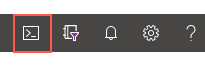
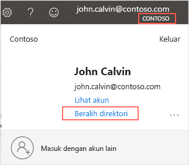

# <a name="how-to-run-microsoft-learn-exercises-in-your-own-subscription"></a><span data-ttu-id="b9579-103">Cara menjalankan latihan Microsoft Learn di langganan pribadi</span><span class="sxs-lookup"><span data-stu-id="b9579-103">How to run Microsoft Learn exercises in your own subscription</span></span>

<span data-ttu-id="b9579-104">Untuk membuat eksperimen dan pembelajaran semudah mungkin, Microsoft Learn menggunakan lingkungan Kotak Pasir.</span><span class="sxs-lookup"><span data-stu-id="b9579-104">To make experimentation and learning as easy as possible, Microsoft Learn utilizes a Sandbox environment.</span></span> <span data-ttu-id="b9579-105">Kotak Pasir memungkinkan Anda melakukan tugas Azure tertentu secara gratis tanpa akun Azure.</span><span class="sxs-lookup"><span data-stu-id="b9579-105">The Sandbox lets you perform specific Azure tasks for free without an Azure account.</span></span> <span data-ttu-id="b9579-106">Namun, lingkungan ini juga mempersulit penyimpanan pekerjaan, pengalihan fungsi untuk penggunaan di lain waktu, atau perluasan di luar batas-batas latihan tertentu.</span><span class="sxs-lookup"><span data-stu-id="b9579-106">However, it also makes it difficult to save your work, repurpose it for later use, or to extend it outside the boundaries of the given exercise.</span></span> <span data-ttu-id="b9579-107">Untuk skenario ini, Anda dapat menjalankan lab di langganan pribadi.</span><span class="sxs-lookup"><span data-stu-id="b9579-107">For these scenarios, you can run the lab in your own subscription.</span></span> 

<span data-ttu-id="b9579-108">Anda juga dapat menggunakan pendekatan ini jika lingkungan Kotak Pasir tidak tersedia karena alasan tertentu.</span><span class="sxs-lookup"><span data-stu-id="b9579-108">You can also use this approach if the Sandbox environment is unavailable for some reason.</span></span>

> [!IMPORTANT]
> <span data-ttu-id="b9579-109">Ingat bahwa jika menggunakan langganan pribadi, Anda akan dikenai biaya untuk setiap sumber daya yang aktif.</span><span class="sxs-lookup"><span data-stu-id="b9579-109">Remember that if you use your own subscription, you will be charged for any active resources.</span></span> <span data-ttu-id="b9579-110">Sebaiknya pantau biaya dengan cermat menggunakan fitur analisis biaya di portal Azure, batalkan alokasi VM apa pun yang tidak digunakan, dan pilih paket harga dengan hati-hati untuk menghindari biaya tak terduga.</span><span class="sxs-lookup"><span data-stu-id="b9579-110">We recommend you monitor your costs carefully using the cost analysis feature in the Azure portal, deallocate any VMs when not in use, and select pricing plans carefully to avoid unexpected charges.</span></span>

## <a name="azure-exercises"></a><span data-ttu-id="b9579-111">Latihan Azure</span><span class="sxs-lookup"><span data-stu-id="b9579-111">Azure exercises</span></span>

<span data-ttu-id="b9579-112">Jika latihan memiliki tombol untuk mengaktifkan Kotak Pasir, Anda harus melakukan langkah-langkah berikut, dan bukan mengaktifkan lingkungan Kotak Pasir baru.</span><span class="sxs-lookup"><span data-stu-id="b9579-112">If the exercise has a button to activate a Sandbox, you should perform the following steps instead of activating a new Sandbox environment.</span></span>

1. <span data-ttu-id="b9579-113">Buka jendela Cloud Shell (hanya diperlukan jika latihan menggunakan baris perintah).</span><span class="sxs-lookup"><span data-stu-id="b9579-113">Open a Cloud Shell window (only necessary if the exercise uses the command-line).</span></span>
1. <span data-ttu-id="b9579-114">Buat grup sumber daya.</span><span class="sxs-lookup"><span data-stu-id="b9579-114">Create a resource group.</span></span>
1. <span data-ttu-id="b9579-115">Pastikan Anda telah masuk ke langganan dan direktori yang benar.</span><span class="sxs-lookup"><span data-stu-id="b9579-115">Make sure to sign into the correct subscription and directory.</span></span>
1. <span data-ttu-id="b9579-116">Gunakan grup sumber daya dalam latihan.</span><span class="sxs-lookup"><span data-stu-id="b9579-116">Use the resource group in the exercise.</span></span>
1. <span data-ttu-id="b9579-117">Hapus sumber daya jika Anda sudah selesai menggunakannya.</span><span class="sxs-lookup"><span data-stu-id="b9579-117">Delete the resources when you are finished with them.</span></span>

<span data-ttu-id="b9579-118">Berikut adalah detail selengkapnya tentang setiap langkah.</span><span class="sxs-lookup"><span data-stu-id="b9579-118">The following provides more details about each step.</span></span>

### <a name="open-a-cloud-shell"></a><span data-ttu-id="b9579-119">Buka Cloud Shell</span><span class="sxs-lookup"><span data-stu-id="b9579-119">Open a Cloud Shell</span></span>

<span data-ttu-id="b9579-120">Beberapa latihan menggunakan Cloud Shell terintegrasi.</span><span class="sxs-lookup"><span data-stu-id="b9579-120">Some exercises use an integrated Cloud Shell.</span></span> <span data-ttu-id="b9579-121">Cloud Shell tidak akan tersedia jika Anda tidak mengaktifkan Kotak Pasir.</span><span class="sxs-lookup"><span data-stu-id="b9579-121">This won’t be available if you don’t activate the Sandbox.</span></span> <span data-ttu-id="b9579-122">Namun, Anda dapat membuka tab atau jendela Azure Cloud Shell baru dengan URL <https://shell.azure.com>, atau dengan meluncurkan [portal Azure](https://portal.azure.com?azure-portal=true) dan menggunakan ikon Cloud Shell di bar alat bagian atas seperti yang diperlihatkan di bawah ini.</span><span class="sxs-lookup"><span data-stu-id="b9579-122">However, you can open a new Azure Cloud Shell tab or window with the URL <https://shell.azure.com>, or by launching the [Azure portal](https://portal.azure.com?azure-portal=true) and using the Cloud Shell icon in the top toolbar as shown below.</span></span>



<span data-ttu-id="b9579-124">Pastikan Anda masuk menggunakan kredensial langganan.</span><span class="sxs-lookup"><span data-stu-id="b9579-124">Make sure to sign in using your subscription credentials.</span></span> <span data-ttu-id="b9579-125">Semua perintah untuk latihan dapat dijalankan dalam shell ini.</span><span class="sxs-lookup"><span data-stu-id="b9579-125">All the commands for the exercise can then be run in this shell.</span></span> <span data-ttu-id="b9579-126">Anda dapat memilih bash atau PowerShell sebagai bagian dari pengalaman dan bahkan beralih antar keduanya sesuai kebutuhan.</span><span class="sxs-lookup"><span data-stu-id="b9579-126">You can select either bash or PowerShell as part of the experience and even switch between them as needed.</span></span>

### <a name="create-a-resource-group"></a><span data-ttu-id="b9579-127">Buat grup sumber daya</span><span class="sxs-lookup"><span data-stu-id="b9579-127">Create a resource group</span></span>

<span data-ttu-id="b9579-128">Grup sumber daya adalah penampung yang menyimpan sumber daya terkait untuk solusi Azure.</span><span class="sxs-lookup"><span data-stu-id="b9579-128">A resource group is a container that holds related resources for an Azure solution.</span></span> <span data-ttu-id="b9579-129">Kotak Pasir membuat grup sumber daya secara otomatis.</span><span class="sxs-lookup"><span data-stu-id="b9579-129">The Sandbox creates a resource group automatically.</span></span> <span data-ttu-id="b9579-130">Anda harus membuat grup permanen sendiri untuk menyimpan sumber daya di langganan.</span><span class="sxs-lookup"><span data-stu-id="b9579-130">You’ll need to create your own persistent group to hold the resources in your subscription.</span></span> <span data-ttu-id="b9579-131">Anda dapat membuat grup sumber daya baru menggunakan Azure CLI, PowerShell, atau portal Azure.</span><span class="sxs-lookup"><span data-stu-id="b9579-131">You can create a new resource group using the Azure CLI, PowerShell, or Azure portal.</span></span>

#### <a name="azure-cli"></a><span data-ttu-id="b9579-132">Azure CLI</span><span class="sxs-lookup"><span data-stu-id="b9579-132">Azure CLI</span></span>

<span data-ttu-id="b9579-133">Masuk ke Azure CLI menggunakan perintah `az login`.</span><span class="sxs-lookup"><span data-stu-id="b9579-133">Sign into the Azure CLI using the `az login` command.</span></span> <span data-ttu-id="b9579-134">Pastikan untuk menggunakan kredensial dengan akses ke langganan yang ingin Anda gunakan.</span><span class="sxs-lookup"><span data-stu-id="b9579-134">Make sure to use credentials with access to the subscription you plan to use.</span></span> <span data-ttu-id="b9579-135">Lalu, gunakan perintah berikut di Azure CLI untuk membuat grup sumber daya baru.</span><span class="sxs-lookup"><span data-stu-id="b9579-135">Then, use the following command in the Azure CLI to create a new resource group.</span></span> <span data-ttu-id="b9579-136">Ganti `{resourceGroupName}` dengan nama unik yang mudah Anda identifikasi.</span><span class="sxs-lookup"><span data-stu-id="b9579-136">Replace the `{resourceGroupName}` with a unique name that is easily identifiable to you.</span></span> <span data-ttu-id="b9579-137">`{location}` merupakan kawasan Azure terdekat.</span><span class="sxs-lookup"><span data-stu-id="b9579-137">The `{location}` should be an Azure region close to you.</span></span> <span data-ttu-id="b9579-138">Anda dapat melihat daftar wilayah yang tersedia dengan perintah az account list-locations.</span><span class="sxs-lookup"><span data-stu-id="b9579-138">You can get a list of available regions with the az account list-locations command.</span></span>

```bash
az group create --name {resourceGroupName} --location {location}
```

#### <a name="powershell"></a><span data-ttu-id="b9579-139">PowerShell</span><span class="sxs-lookup"><span data-stu-id="b9579-139">PowerShell</span></span>

<span data-ttu-id="b9579-140">PowerShell sangat mirip – Anda akan membutuhkan modul Azure PowerShell, dan perlu masuk ke langganan Azure dengan cmdlet `Connect-AzAccount`.</span><span class="sxs-lookup"><span data-stu-id="b9579-140">PowerShell is very similar – you will need the Azure PowerShell module, and will need to login to your Azure subscription with the `Connect-AzAccount` cmdlet.</span></span> <span data-ttu-id="b9579-141">Kemudian Anda dapat membuat grup sumber daya baru dengan cmdlet `New-AzResourceGroup` seperti yang diperlihatkan di bawah ini.</span><span class="sxs-lookup"><span data-stu-id="b9579-141">Then you can create a new resource group with the `New-AzResourceGroup` cmdlet as shown below.</span></span>

```powershell
New-AzResourceGroup -Name {resourceGroupName} -Location {location}
```

#### <a name="azure-portal"></a><span data-ttu-id="b9579-142">portal Microsoft Azure</span><span class="sxs-lookup"><span data-stu-id="b9579-142">Azure portal</span></span>

<span data-ttu-id="b9579-143">Terakhir, Anda dapat menggunakan portal Azure untuk membuat grup sumber daya.</span><span class="sxs-lookup"><span data-stu-id="b9579-143">Finally, you can use the Azure portal to create a resource group.</span></span> <span data-ttu-id="b9579-144">Di sebagian besar kasus, Anda dapat melakukannya sebagai bagian dari pembuatan sumber daya dengan memilih “Baru” sebagai bagian dari layar pembuatan sumber daya.</span><span class="sxs-lookup"><span data-stu-id="b9579-144">In many cases, you can do this as part of the resource creation by selecting “New” as part of the resource create screens.</span></span> <span data-ttu-id="b9579-145">Atau, Anda dapat membuat grup sumber daya baru dengan langkah-langkah berikut:</span><span class="sxs-lookup"><span data-stu-id="b9579-145">Alternatively, you can create a new resource group with the following steps:</span></span>

1. <span data-ttu-id="b9579-146">Masuk ke [portal Azure](https://portal.azure.com/?azure-portal=true).</span><span class="sxs-lookup"><span data-stu-id="b9579-146">Sign into the [Azure portal](https://portal.azure.com/?azure-portal=true).</span></span>
1. <span data-ttu-id="b9579-147">Pilih **+ Buat sumber daya** dari bar samping sebelah kiri.</span><span class="sxs-lookup"><span data-stu-id="b9579-147">Select **+ Create a resource** from the left sidebar.</span></span>
1. <span data-ttu-id="b9579-148">Ketik “Grup sumber daya” dalam kotak pencarian, lalu pilih dari hasil yang muncul.</span><span class="sxs-lookup"><span data-stu-id="b9579-148">Type “Resource group” in the search box and select it from the results.</span></span>
1. <span data-ttu-id="b9579-149">Pilih **Buat** di halaman deskripsi.</span><span class="sxs-lookup"><span data-stu-id="b9579-149">Select **Create** on the description page.</span></span>
1. <span data-ttu-id="b9579-150">Pilih langganan Anda, beri nama untuk grup sumber daya yang baru, lalu pilih lokasi (kawasan) tempat Anda ingin membuat grup.</span><span class="sxs-lookup"><span data-stu-id="b9579-150">Select your subscription, give the new resource group a name, and pick the location (region) you want to create the group in.</span></span>
1. <span data-ttu-id="b9579-151">Pilih **Tinjau + Buat** dan selesaikan pembuatan grup.</span><span class="sxs-lookup"><span data-stu-id="b9579-151">Select **Review + Create** and finalize the creation of the group.</span></span>

### <a name="verify-the-selected-azure-subscription-and-directory"></a><span data-ttu-id="b9579-152">Verifikasi langganan dan direktori Azure yang dipilih</span><span class="sxs-lookup"><span data-stu-id="b9579-152">Verify the selected Azure subscription and directory</span></span>

<span data-ttu-id="b9579-153">Jika Anda menggunakan portal Azure selama latihan, pastikan untuk menggunakan kredensial langganan yang benar.</span><span class="sxs-lookup"><span data-stu-id="b9579-153">If you use the Azure portal during the exercise, make sure to use the correct subscription credentials.</span></span> <span data-ttu-id="b9579-154">Dalam beberapa kasus, tautan dalam instruksi mungkin akan mengarahkan Anda ke direktori **Microsoft Learn**.</span><span class="sxs-lookup"><span data-stu-id="b9579-154">In some cases, the link in the instructions might try to put you into the **Microsoft Learn** directory.</span></span> <span data-ttu-id="b9579-155">Tautan ini tidak akan berfungsi karena Anda tidak memiliki izin untuk membuat sumber daya.</span><span class="sxs-lookup"><span data-stu-id="b9579-155">This won’t work because you won’t have the permissions to create resources.</span></span>

<span data-ttu-id="b9579-156">Setelah masuk, periksa akun Anda saat ini di sudut kanan atas portal Azure.</span><span class="sxs-lookup"><span data-stu-id="b9579-156">Once you’re signed in, check your current account in the top-right corner of the Azure portal.</span></span> <span data-ttu-id="b9579-157">Jika tidak melihat nama perusahaan yang benar di bawah nama Anda, Anda mungkin berada di direktori yang salah.</span><span class="sxs-lookup"><span data-stu-id="b9579-157">If you don’t see the correct company name under your name, you are likely in the wrong directory.</span></span> <span data-ttu-id="b9579-158">Pilih nama Anda, lalu pilih **Beralih Direktori** untuk mengubah direktori saat ini.</span><span class="sxs-lookup"><span data-stu-id="b9579-158">Select your name and then select **Switch Directory** to change the current directory.</span></span>



### <a name="using-the-resource-group"></a><span data-ttu-id="b9579-160">Menggunakan grup sumber daya</span><span class="sxs-lookup"><span data-stu-id="b9579-160">Using the resource group</span></span>

<span data-ttu-id="b9579-161">Di sepanjang instruksi latihan, Anda akan menemukan referensi ke grup yang telah dibuat sebelumnya, yang sering kali dicantumkan sebagai `"[sandbox resource group name]"` dalam langkah-langkah latihan atau sampel kode.</span><span class="sxs-lookup"><span data-stu-id="b9579-161">Throughout the exercise instructions, you’ll find references to this pre-created group, often listed as `"[sandbox resource group name]"` in the exercise steps or code samples.</span></span> <span data-ttu-id="b9579-162">Nilai tempat penampung ini akan diganti dengan nama asli setelah Anda mengaktifkan Kotak Pasir.</span><span class="sxs-lookup"><span data-stu-id="b9579-162">This placeholder value is replaced with a real name once you activate the Sandbox.</span></span> <span data-ttu-id="b9579-163">Nilai ini haru diganti setiap kali Anda melihatnya dengan nama grup sumber daya Anda.</span><span class="sxs-lookup"><span data-stu-id="b9579-163">You’ll need to replace this value each time you see it with your own resource group name.</span></span> <span data-ttu-id="b9579-164">Misalnya, jika Anda membuat grup sumber daya bernama `learn-rg`, pastikan untuk menggunakan nama tersebut setiap kali Anda melihat tempat penampung.</span><span class="sxs-lookup"><span data-stu-id="b9579-164">For example, if you created a resource group named `learn-rg`, then make sure to use that name each time you see the placeholder.</span></span>

> [!IMPORTANT]
> <span data-ttu-id="b9579-165">Pastikan untuk menggunakan grup sumber daya yang sama untuk semua sumber daya yang Anda buat dalam latihan.</span><span class="sxs-lookup"><span data-stu-id="b9579-165">Make sure to use the same resource group for all the resources you create in the exercise.</span></span> <span data-ttu-id="b9579-166">Hal ini guna memudahkan Anda melacak biaya serta membersihkan semuanya ketika sudah selesai menggunakannya.</span><span class="sxs-lookup"><span data-stu-id="b9579-166">This makes it easier to track the cost as well as clean them all up when you are finished with them.</span></span>

### <a name="delete-the-resources-when-you-are-finished"></a><span data-ttu-id="b9579-167">Hapus sumber daya ketika sudah selesai</span><span class="sxs-lookup"><span data-stu-id="b9579-167">Delete the resources when you are finished</span></span>

<span data-ttu-id="b9579-168">Setelah latihan selesai di langganan Anda, semua sumber daya akan terus aktif hingga Anda menghapusnya.</span><span class="sxs-lookup"><span data-stu-id="b9579-168">Once the exercise is completed in your subscription, the resources will all continue to live until you delete them yourself.</span></span> <span data-ttu-id="b9579-169">**Kemampuan penghapusan otomatis tidak tersedia saat Anda menggunakan langganan pribadi.**</span><span class="sxs-lookup"><span data-stu-id="b9579-169">**There is no automatic deletion capability when using your own subscription.**</span></span> <span data-ttu-id="b9579-170">Ketika Anda sudah siap untuk menghapus semua sumber daya, gunakan langkah-langkah berikut:</span><span class="sxs-lookup"><span data-stu-id="b9579-170">When you are ready to delete all the resources, use the following steps:</span></span>

#### <a name="azure-cli"></a><span data-ttu-id="b9579-171">Azure CLI</span><span class="sxs-lookup"><span data-stu-id="b9579-171">Azure CLI</span></span>

<span data-ttu-id="b9579-172">Gunakan perintah berikut di Azure CLI untuk menghapus grup sumber daya dan semua sumber daya yang terkait.</span><span class="sxs-lookup"><span data-stu-id="b9579-172">Use the following command in the Azure CLI to delete the resource group and all related resources.</span></span> <span data-ttu-id="b9579-173">Ganti `{resourceGroupName}` dengan nama grup sumber daya yang telah Anda buat.</span><span class="sxs-lookup"><span data-stu-id="b9579-173">Replace the `{resourceGroupName}` with the name of the resource group you created.</span></span>

```bash
az group delete -n {resourceGroupName}
```

#### <a name="powershell"></a><span data-ttu-id="b9579-174">PowerShell</span><span class="sxs-lookup"><span data-stu-id="b9579-174">PowerShell</span></span>

<span data-ttu-id="b9579-175">PowerShell sangat mirip.</span><span class="sxs-lookup"><span data-stu-id="b9579-175">PowerShell is very similar.</span></span>

```powershell
Remove-AzResourceGroup -Name {resourceGroupName}
```

#### <a name="azure-portal"></a><span data-ttu-id="b9579-176">portal Microsoft Azure</span><span class="sxs-lookup"><span data-stu-id="b9579-176">Azure portal</span></span>

<span data-ttu-id="b9579-177">Terakhir, Anda dapat menggunakan portal Azure untuk menghapus grup sumber daya.</span><span class="sxs-lookup"><span data-stu-id="b9579-177">Finally, you can use the Azure portal to delete a resource group.</span></span> <span data-ttu-id="b9579-178">Gunakan langkah-langkah berikut.</span><span class="sxs-lookup"><span data-stu-id="b9579-178">Use the following steps.</span></span>

1. <span data-ttu-id="b9579-179">Masuk ke [portal Azure](https://portal.azure.com/?azure-portal=true).</span><span class="sxs-lookup"><span data-stu-id="b9579-179">Sign into the [Azure portal](https://portal.azure.com/?azure-portal=true).</span></span>
1. <span data-ttu-id="b9579-180">Ketikkan nama grup sumber daya Anda ke dalam kotak Pencarian di bagian atas.</span><span class="sxs-lookup"><span data-stu-id="b9579-180">Type the name of your resource group into the Search box at the top.</span></span>
1. <span data-ttu-id="b9579-181">Pilih grup sumber daya untuk memperlihatkan detail.</span><span class="sxs-lookup"><span data-stu-id="b9579-181">Select the resource group to show the details.</span></span> <span data-ttu-id="b9579-182">Anda akan melihat semua sumber daya yang telah dibuat.</span><span class="sxs-lookup"><span data-stu-id="b9579-182">You should see all your created resources.</span></span>
1. <span data-ttu-id="b9579-183">Pilih **Hapus grup sumber daya** dari bar alat.</span><span class="sxs-lookup"><span data-stu-id="b9579-183">Select **Delete resource group** from the toolbar.</span></span> <span data-ttu-id="b9579-184">Jawab pemberitahuan "Apakah Anda yakin", lalu klik **Hapus** untuk menyelesaikan proses.</span><span class="sxs-lookup"><span data-stu-id="b9579-184">Complete the "Are you sure" prompt and click **Delete** to finish the process.</span></span>

## <a name="microsoft-dynamics-365-sales-customer-service-field-service--marketing-exercises"></a><span data-ttu-id="b9579-185">Latihan Microsoft Dynamics 365 Sales, Customer Service, Field Service & Marketing</span><span class="sxs-lookup"><span data-stu-id="b9579-185">Microsoft Dynamics 365 Sales, Customer Service, Field Service & Marketing exercises</span></span>

<span data-ttu-id="b9579-186">Sebelum memulai latihan, mintalah [lingkungan uji coba](https://trials.dynamics.com/Dynamics365/signup/) dari Microsoft dan gunakan himpunan data sampel yang telah disediakan.</span><span class="sxs-lookup"><span data-stu-id="b9579-186">Before starting the exercise, request a [trial environment](https://trials.dynamics.com/Dynamics365/signup/) from Microsoft and use the pre-provided sample data set.</span></span>

<span data-ttu-id="b9579-187">Jika Anda mengubah data sampel dan mengalami masalah pada lab berikutnya, ikuti instruksi berikut untuk [mengatur ulang data sampel lingkungan Anda](https://docs.microsoft.com/power-platform/admin/add-remove-sample-data).</span><span class="sxs-lookup"><span data-stu-id="b9579-187">If you alter the sample data and encounter problems with subsequent labs, follow these instructions to [reset your environment’s sample data](https://docs.microsoft.com/power-platform/admin/add-remove-sample-data).</span></span>

## <a name="microsoft-dynamics-365-finance-supply-chain-management-and-commerce-exercises"></a><span data-ttu-id="b9579-188">Latihan Microsoft Dynamics 365 Finance, Supply Chain Management, dan Commerce</span><span class="sxs-lookup"><span data-stu-id="b9579-188">Microsoft Dynamics 365 Finance, Supply Chain Management, and Commerce exercises</span></span>

<span data-ttu-id="b9579-189">Sebelum memulai latihan, mintalah [lingkungan percobaan](https://trials.dynamics.com/Dynamics365/signup/) Dynamics 365 Finance & Operations dari Microsoft dan gunakan himpunan data sampel yang telah disediakan.</span><span class="sxs-lookup"><span data-stu-id="b9579-189">Before starting the exercise, request a Dynamics 365 Finance & Operations [trial environment](https://trials.dynamics.com/Dynamics365/signup/) from Microsoft and use the pre-provided sample data set.</span></span>

<span data-ttu-id="b9579-190">Setelah modul selesai, Anda dapat mengikuti instruksi ini untuk [memperbarui data demo Anda](https://docs.microsoft.com/dynamics365/fin-ops-core/dev-itpro/data-entities/generate-demo-data-packages) guna mengatur ulang data untuk modul berikutnya.</span><span class="sxs-lookup"><span data-stu-id="b9579-190">Once the module is complete, you can follow these instructions to [regenerate your demo data](https://docs.microsoft.com/dynamics365/fin-ops-core/dev-itpro/data-entities/generate-demo-data-packages) to reset the data for the next module.</span></span>
